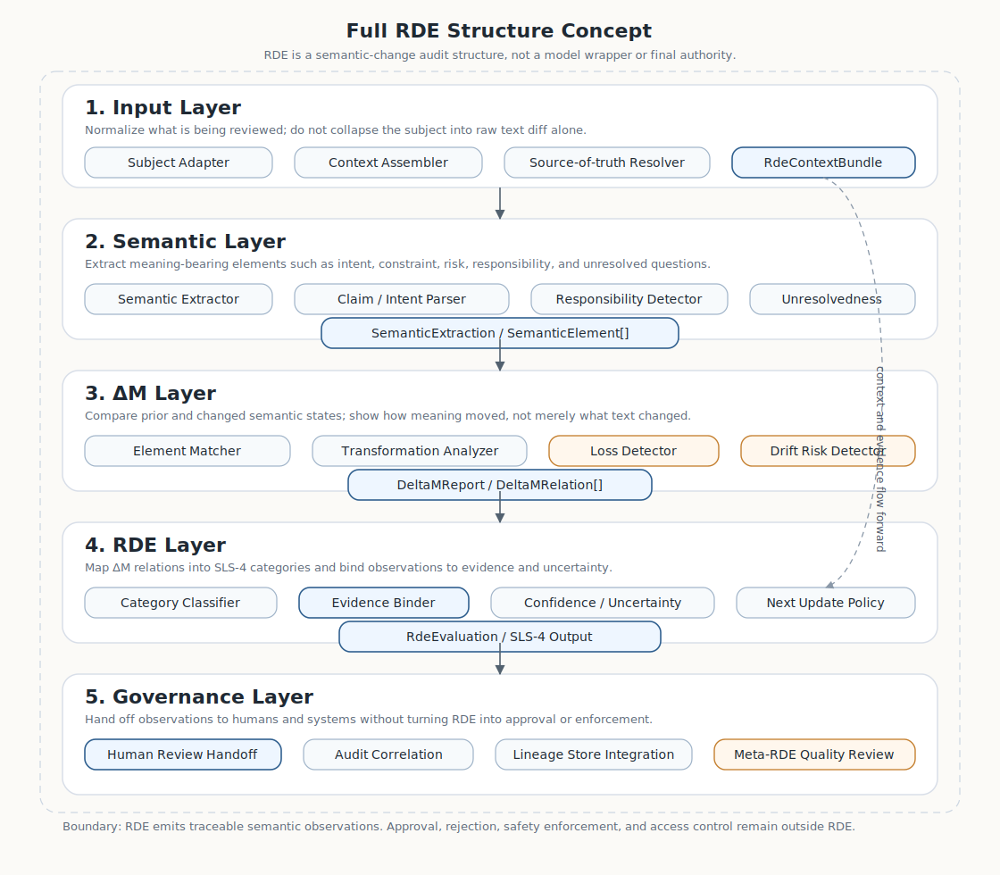

# Roadmap toward a full RDE implementation

Status: **design roadmap / non-normative implementation guidance**

Tracked by: [zyx-corporation/kotonoha-core#14](https://github.com/zyx-corporation/kotonoha-core/issues/14)

Source specification: [`kotonoha-spec` SLS-5 RDE implementation specification](https://github.com/zyx-corporation/kotonoha-spec/blob/main/docs/rde-implementation-specification.md)

## 1. Purpose

This document describes how `kotonoha-core` should evolve from the current **SLS-5 implementation scaffold** toward a fuller RDE implementation.

The current implementation provides explicit boundaries and minimal deterministic behavior. It does **not** claim complete semantic understanding. A full RDE should be understood as a **semantic-change audit structure**, not merely a smarter evaluator.

RDE must remain:

- a producer and validator of semantic review observations;
- grounded in traceable evidence;
- connected to lineage and audit records;
- separate from policy enforcement;
- separate from final human approval or rejection.

## 2. Current state

The current `kotonoha-core` scaffold provides:

| Component | Current implementation | Role |
| --- | --- | --- |
| Subject adapter | `RdeSubject` | Holds `subject_ref`, optional source/changed text, and source refs. |
| Context provider | `RdeContext` | Holds prior lineage, prior RDE output, audit correlation, and human context refs. |
| Evaluator boundary | `RdeEvaluator` | Trait for evaluation implementations. |
| Minimal evaluator | `ConservativeRdeEvaluator` | Deterministic scaffold for tests and demos; not deep semantic understanding. |
| Output object | `RdeEvaluation` | Emits SLS-4-compatible RDE review output. |
| Traceability | `RdeTraceability` | Carries subject, lineage, prior RDE, audit, and source references. |
| Validator | `RdeEvaluation::validate` | Reuses existing SLS-4 `crate::rde::validate_json`. |

This is enough to make SLS-5 responsibilities visible in code. It is not enough to make RDE complete.

## 3. Design principle

A full RDE is not an LLM wrapper.

LLMs or smaller language models may assist extraction, classification, or explanation, but RDE itself is the architecture that binds together:

- subject identity;
- prior context;
- semantic elements;
- ΔM analysis;
- category classification;
- evidence references;
- uncertainty notes;
- lineage persistence;
- audit correlation;
- human review handoff;
- meta-review of RDE output quality.

The core should remain model-agnostic. Model-backed evaluators should be plugins or adapters behind traits, not hard requirements of `kotonoha-core`.

## 4. Target layered architecture

A fuller RDE implementation should evolve toward the following layers.

[HTML rendering of this structure](full-rde-structure.html) is available for browser review. The source SVG is [`assets/full-rde-structure.svg`](assets/full-rde-structure.svg).



The SVG above is a conceptual diagram. It illustrates the intended implementation direction, but the normative source remains `kotonoha-spec` SLS-5 and the Rust contracts that this repository actually exposes.

```text
Input layer
  ├─ Subject Adapter
  ├─ Context Assembler
  └─ Source-of-truth Resolver

Semantic layer
  ├─ Semantic Extractor
  ├─ Claim / Intent / Constraint Parser
  ├─ Responsibility Detector
  └─ Unresolvedness Detector

ΔM layer
  ├─ Semantic Element Matcher
  ├─ Transformation Analyzer
  ├─ Loss Detector
  └─ Drift Risk Detector

RDE layer
  ├─ Category Classifier
  ├─ Evidence Binder
  ├─ Confidence / Uncertainty Notes
  └─ Next Update Policy Generator

Governance layer
  ├─ Human Review Handoff
  ├─ Audit Correlation
  ├─ Lineage Store Integration
  └─ Meta-RDE Quality Review
```

## 5. Layer responsibilities

### 5.1 Input layer

The input layer decides **what is being reviewed**.

It should normalize documents, patches, pull requests, generated text, design decisions, or lineage units into an RDE subject.

Future work:

```rust
pub struct RdeContextBundle {
    pub subject: RdeSubject,
    pub source_intent: Option<String>,
    pub non_goals: Vec<String>,
    pub must_not_lose: Vec<String>,
    pub related_spec_sections: Vec<String>,
    pub prior_rde_outputs: Vec<String>,
    pub audit_refs: Vec<String>,
    pub human_review_notes: Vec<String>,
}
```

The input layer must not collapse the review subject into raw text diff alone.

### 5.2 Semantic layer

The semantic layer extracts meaning-bearing elements from source and changed material.

Future work:

```rust
pub enum SemanticElementKind {
    Intent,
    Constraint,
    Assumption,
    Risk,
    Responsibility,
    UnresolvedQuestion,
    ValueClaim,
    FactualClaim,
}

pub struct SemanticElement {
    pub id: String,
    pub kind: SemanticElementKind,
    pub text: String,
    pub source_ref: Option<String>,
    pub confidence_note: Option<String>,
    pub scope: Option<String>,
}

pub struct SemanticExtraction {
    pub subject_ref: String,
    pub elements: Vec<SemanticElement>,
}
```

The semantic layer may be rule-based, model-assisted, or human-curated. The representation should not depend on one model vendor or prompt style.

### 5.3 ΔM layer

The ΔM layer compares prior and changed semantic states.

Future work:

```rust
pub enum DeltaMRelationKind {
    Preserved,
    Transformed,
    Complemented,
    Weakened,
    Removed,
    Split,
    Merged,
    Contradicted,
    Unresolved,
}

pub struct DeltaMRelation {
    pub source_element_id: Option<String>,
    pub target_element_id: Option<String>,
    pub relation: DeltaMRelationKind,
    pub summary: String,
    pub evidence_refs: Vec<String>,
}

pub struct DeltaMReport {
    pub subject_ref: String,
    pub relations: Vec<DeltaMRelation>,
}
```

This layer is where RDE becomes more than categorized commentary. It should show how meaning moved.

### 5.4 RDE classification layer

The classification layer maps ΔM relations into SLS-4 categories:

- `preserved`
- `transformed`
- `complemented`
- `intentionally_unresolved`
- `lost`
- `deviation_risk`
- `next_update_policy`

Future work:

```rust
pub trait RdeClassifier {
    fn classify(&self, report: &DeltaMReport) -> Result<RdeEvaluation, RdeError>;
}
```

Classification must remain evidence-linked. A category label without evidence is too close to a model opinion.

### 5.5 Evidence binder

The evidence binder connects observations to specific sources.

Evidence may include:

- document spans;
- patch hunks;
- issue comments;
- specification section identifiers;
- prior RDE observations;
- lineage unit identifiers;
- audit records;
- human review notes.

Future work:

```rust
pub struct EvidenceRef {
    pub kind: String,
    pub uri: Option<String>,
    pub label: Option<String>,
    pub span: Option<String>,
}
```

Evidence binding is required for trust. Without it, RDE output becomes impressionistic.

### 5.6 Governance layer

The governance layer hands RDE observations to humans and systems without pretending to decide for them.

It should output review focus, not approval.

Allowed:

- missing context warning;
- drift risk note;
- suggested reviewer focus;
- next update policy;
- audit correlation.

Not allowed as RDE output:

- approved;
- rejected;
- safe;
- unsafe;
- access granted;
- access denied.

Policy engines may consume RDE observations, but that is a separate layer.

### 5.7 Meta-RDE layer

The meta-RDE layer reviews RDE output quality.

It should detect:

- repetitive generic categories;
- weak or missing evidence;
- overclaiming;
- false closure;
- category misuse;
- missing loss analysis;
- missing uncertainty notes;
- failure to preserve human authority boundaries.

This is especially important if LLM-assisted evaluators are introduced.

## 6. Proposed trait architecture

The next substantive implementation stage should introduce traits rather than one monolithic evaluator.

```rust
pub trait SemanticExtractor {
    fn extract(
        &self,
        subject: &RdeSubject,
        context: &RdeContextBundle,
    ) -> Result<SemanticExtraction, RdeError>;
}

pub trait DeltaMAnalyzer {
    fn analyze(
        &self,
        source: &SemanticExtraction,
        target: &SemanticExtraction,
    ) -> Result<DeltaMReport, RdeError>;
}

pub trait RdeClassifier {
    fn classify(&self, report: &DeltaMReport) -> Result<RdeEvaluation, RdeError>;
}

pub trait EvidenceBinder {
    fn bind_evidence(&self, evaluation: &mut RdeEvaluation) -> Result<(), RdeError>;
}
```

This keeps the core extensible:

- rule-based extractors can be implemented first;
- model-backed extractors can be added later;
- human-curated extractors can be supported;
- validators remain independent of model choices.

## 7. Implementation phases

### Phase A — Current scaffold

Delivered:

- `RdeSubject`
- `RdeContext`
- `RdeEvaluator`
- `ConservativeRdeEvaluator`
- `RdeEvaluation`
- SLS-4-compatible output validation
- SLS-5 traceability documentation

### Phase B — Context bundle and semantic elements

**Status: scaffold introduced (2026-06-05).**

Delivered:

- `RdeError` — extraction/validation error enum (extensible for later phases).
- `RdeContextBundle` — wraps `RdeSubject` with source intent, non-goals, must-not-lose, spec sections, prior RDE refs, audit refs, and human review notes.
- `SemanticElementKind` — `Intent`, `Constraint`, `Assumption`, `Risk`, `Responsibility`, `UnresolvedQuestion`, `ValueClaim`, `FactualClaim`.
- `SemanticElement` — typed container with `id`, `kind`, `text`, `source_ref`, `confidence_note`, `scope`.
- `SemanticExtraction` — collection of `SemanticElement` per subject.
- `SemanticExtractor` trait — extensible boundary for rule-based, model-assisted, and human-curated extractors.
- `ConservativeSemanticExtractor` — deterministic, rule-based implementation that maps supplied context fields into typed elements without deep semantic analysis, LLM dependency, or approval/rejection verdicts.

Module: [`src/rde_semantic.rs`](../src/rde_semantic.rs).

This is not "semantic understanding complete." It is the structural scaffolding for meaning-bearing elements so that later ΔM analysis can compare how intent, constraints, risks, responsibilities, unresolved questions, and value/factual claims move across revisions.

### Phase C — ΔM report model

**Status: scaffold introduced (2026-06-05).**

Delivered:

- `DeltaMRelationKind` — `Preserved`, `Transformed`, `Complemented`, `Weakened`, `Removed`, `Split`, `Merged`, `Contradicted`, `Unresolved`.
- `DeltaMRelation` — typed container with `source_element_id`, `target_element_id`, `relation`, `summary`, `evidence_refs`.
- `DeltaMReport` — collection of `DeltaMRelation` per subject.
- `DeltaMAnalyzer` trait — extensible boundary for rule-based, model-assisted, and human-curated analyzers.
- `ConservativeDeltaMAnalyzer` — deterministic, id-based matcher that compares `SemanticExtraction` objects using id/kind/text rules.

Module: [`src/rde_delta.rs`](../src/rde_delta.rs).

This is **not** full semantic ΔM analysis. `Weakened`, `Split`, `Merged`, `Contradicted`, and `Unresolved` are enum variants reserved for future analyzers. The conservative analyzer only generates `Preserved`, `Transformed`, `Removed`, and `Complemented` from deterministic id-based comparison.

Pipeline position:

```text
Phase B: RdeContextBundle → SemanticExtraction
Phase C: SemanticExtraction × SemanticExtraction → DeltaMReport
Phase D: DeltaMReport → RdeEvaluation / SLS-4 categories
```

### Phase D — RDE classifier pipeline

**Status: classifier scaffold introduced (2026-06-05).**

Delivered:

- `RdeClassifier` trait — extensible boundary for mapping `DeltaMReport` into `RdeEvaluation`.
- `ConservativeRdeClassifier` — deterministic, conservative mapping that follows the design gate constraints.

Design gate: [`docs/rde-phase-d-classifier-design-gate.md`](rde-phase-d-classifier-design-gate.md).

Module: [`src/rde_classifier.rs`](../src/rde_classifier.rs).

This is **not** full RDE semantic judgment. The classifier emits review-focused observations only. Final judgment belongs to the human review layer.

Mapping policy (conservative):

| ΔM relation | RDE category | Notes |
|---|---|---|
| `Preserved` | `preserved` | Direct. |
| `Transformed` | `transformed` | With uncertainty note if evidence absent. |
| `Complemented` | `complemented` | No value judgment. |
| `Removed` | `next_update_policy` | **Not** `lost`. Human review required. |
| `Contradicted` / `Weakened` | `next_update_policy` | **Not** `deviation_risk`. |
| `Unresolved` | `next_update_policy` | **Not** automatically `intentionally_unresolved`. |
| `Split` / `Merged` | `transformed` | With uncertainty note. |

### Phase E — Evidence binder

**Status: minimal structs introduced (2026-06-05).**

Design gate: [`docs/evidence-binder-design.md`](evidence-binder-design.md).

Delivered:

- `EvidenceRef`, `EvidenceRole`, `TextSpan` — typed evidence reference structures.
- `EvidenceBinding`, `EvidenceBindingReport` — binding containers.
- `bind_evidence_minimal()` — minimal evidence binding preserving classification without reclassifying.

Module: [`src/rde_evidence.rs`](../src/rde_evidence.rs).

Pipeline position:

```text
Phase D: DeltaMReport → RdeEvaluation / SLS-4
Phase E: RdeEvaluation × Source Context → EvidenceBindingReport
Human Review: EvidenceBindingReport → approval / rejection / revision
```

### Phase F — Meta-RDE

**Status: minimal structs introduced (2026-06-05).**

Design gate: [`docs/meta-rde-design.md`](meta-rde-design.md).

Delivered:

- `MetaRdeSeverity`, `PipelinePhase` — typed severity and phase enums.
- `MetaRdeFinding`, `MetaRdeReport` — finding and report containers.
- `run_meta_rde_minimal()` — minimal audit inspecting `EvidenceBindingReport` for missing evidence and uncertainty.

Module: [`src/meta_rde.rs`](../src/meta_rde.rs).

Pipeline position:

```text
Phase E: RdeEvaluation × Source Context → EvidenceBindingReport
Phase F: Full Pipeline Output → MetaRdeReport
Human Review: EvidenceBindingReport + MetaRdeReport → approval / rejection / revision
```

### Phase G — Combined review report

**Status: markdown report introduced (2026-06-05).**

Delivered:

- `RdeCombinedReviewReport` — integrates `EvidenceBindingReport` + `MetaRdeReport` into a single review artifact.
- `build_combined_review_report()` — aggregates reviewer focus, unresolved, and next-update policy items.
- `render_combined_review_markdown()` — generates Markdown with mandatory Non-Judgment Boundary section.

Module: [`src/rde_report.rs`](../src/rde_report.rs).

The combined report is a review artifact, **not** a decision object. It does not carry approval, rejection, or safety verdict fields. The Non-Judgment Boundary section explicitly states this.

### Phase H — Human Review Decision Model

**Status: design gate introduced (2026-06-06) — implementation not started.**

Design gate: [`docs/human-review-decision-model.md`](human-review-decision-model.md).

Phase H is the first layer that may express `approve`, `reject`, `request revision`, or `defer`. However, the decision belongs to the human reviewer. Phase H is an external audit record, not an automatic decision engine.

Pipeline position:

```text
Phase G: EvidenceBindingReport + MetaRdeReport → Combined Review Report
Phase H: Combined Review Report + Reviewer → HumanReviewDecision
```

Future implementation candidates:

- `HumanReviewDecision`, `HumanReviewDecisionKind`
- `HumanReviewReason`, `HumanReviewAction`
- decision recording from Combined Review Report

### Phase I — Model-assisted evaluator adapters

Add optional adapters outside the core minimum.

Requirements:

- no model dependency in default core;
- schema validation after model output;
- evidence-bound output;
- uncertainty notes;
- meta-RDE review hooks.

Candidate issue:

```text
impl: define optional model-assisted RDE adapter interface
```

## 8. Non-goals

The roadmap does not require:

- a specific model provider;
- a specific prompt format;
- a claim that current scaffold is semantically complete;
- automatic approval/rejection;
- a universal safety filter;
- product UI behavior;
- full persistence design.

## 9. RDE drift risks to avoid

| Risk | Why it matters | Mitigation |
| --- | --- | --- |
| Treating RDE as a linter | Reduces meaning audit to syntax or style checks | Preserve semantic element and ΔM layers. |
| Treating an LLM as RDE | Confuses model output with institutional review structure | Keep model assistance behind traits and validators. |
| Treating category labels as evidence | Produces plausible but ungrounded review | Require evidence refs for mature implementations. |
| Treating RDE as approval | Violates SLS-5 human authority boundary | Keep approval outside RDE output. |
| Treating Git diff as semantic diff | Misses responsibility, scope, and unresolvedness | Build semantic extraction and ΔM report layers. |
| Treating memory as authority | Confuses stored observation with decision | Store refs and observations, not final decisions. |

## 10. Immediate next step

The recommended next implementation issue is:

```text
impl: add RdeContextBundle and SemanticElement extraction scaffold
```

This should not make `ConservativeRdeEvaluator` smarter directly. Instead, it should insert the missing semantic extraction structure before classification. Without that layer, RDE risks remaining a category-labeled comment generator.
